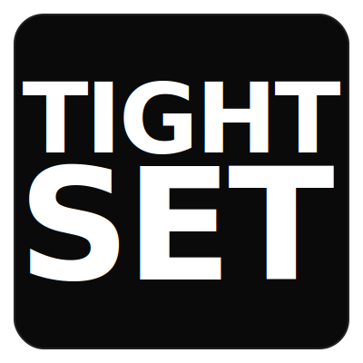

<p align="center">
  
</p>

<h1 align="center">tightset</h1>

<p align="center">
  Variable-weight text fitting engine. Fill any rectangle with kinetic typography.<br>
  <a href="https://dmoptimal.github.io/tightset/"><strong>Live demo &rarr;</strong></a>
</p>

Every line stretches to fill the width, with heavier weight on larger lines. Works with any variable-weight font. Ships with **React**, **Svelte**, **Vue**, **Angular**, vanilla Canvas, and DOM/Tailwind renderers.

## Install

```bash
npm install tightset
```

## Quick Start

```ts
import { fit } from 'tightset'
import { render } from 'tightset/canvas'

const result = fit('Every Line Fills The Width', {
  width: 800,
  height: 500,
  fontFamily: 'Inter',
})

render(document.querySelector('canvas'), result, {
  fontFamily: 'Inter',
  color: '#ffffff',
  background: '#0d0d0d',
})
```

## Packages

| Import | What |
|--------|------|
| `tightset` | Core engine: `fit()`, `clearCache()`, `setMeasureContext()` |
| `tightset/canvas` | Canvas 2D `draw()` and `render()` |
| `tightset/dom` | `renderToHTML()`, `renderToDOM()`, `getLineStyles()` — for Tailwind/CSS |
| `tightset/react` | `<Tightset>` React component |
| `tightset/svelte` | `<Tightset>` Svelte component |
| `tightset/vue` | `<Tightset>` Vue component |
| `tightset/angular` | `<TightsetComponent>` Angular standalone component |

## React

```tsx
import { Tightset } from 'tightset/react'

<Tightset
  text="Make It Tight"
  width={800}
  height={500}
  fontFamily="Inter"
  color="#fff"
  background="#000"
/>
```

## Svelte

```svelte
<script>
  import Tightset from 'tightset/svelte'
</script>

<Tightset
  text="Hello World"
  width={800}
  height={500}
  fontFamily="Inter"
  color="#fff"
  background="#000"
/>
```

## Vue

```vue
<script setup>
import Tightset from 'tightset/vue'
</script>

<template>
  <Tightset
    text="Hello World"
    :width="800"
    :height="500"
    fontFamily="Inter"
    mode="html"
  />
</template>
```

## Angular

```ts
import { TightsetComponent } from 'tightset/angular'

@Component({
  standalone: true,
  imports: [TightsetComponent],
  template: `
    <tightset
      text="Make It Tight"
      [width]="800"
      [height]="500"
      fontFamily="Inter"
      color="#ffffff"
      background="#0d0d0d"
    />
  `,
})
export class MyComponent {}
```

## Tailwind / DOM

```ts
import { fit } from 'tightset'
import { renderToHTML } from 'tightset/dom'

const result = fit('Style Me', { width: 800, height: 400, fontFamily: 'Inter' })
const html = renderToHTML(result, {
  fontFamily: 'Inter',
  containerClass: 'bg-black rounded-2xl',
  lineClass: 'tracking-tight drop-shadow-lg',
})
```

Or get style objects for JSX:

```tsx
import { getLineStyles } from 'tightset/dom'

const styles = getLineStyles(result, { fontFamily: 'Inter' })
result.lines.map((line, i) => <div style={styles[i]} className="drop-shadow-lg">{line}</div>)
```

## Options

| Option | Default | Description |
|--------|---------|-------------|
| `width` | — | Box width (px, required) |
| `height` | — | Box height (px, required) |
| `fontFamily` | `'sans-serif'` | Font family name |
| `padX` | `60` | Horizontal padding |
| `padY` | `40` | Vertical padding |
| `gap` | `20` | Line gap |
| `maxWeight` | `900` | Heaviest font weight |
| `spread` | `150` | Weight range (heavy − light) |
| `maxLines` | `8` | Max lines |
| `uppercase` | `true` | Uppercase transform |

## Node.js / SSR

```ts
import { createCanvas } from 'canvas'
import { setMeasureContext, fit } from 'tightset'

setMeasureContext(createCanvas(1, 1).getContext('2d'))
const result = fit('Server Side', { width: 800, height: 400 })
```

## Demo

**[Live demo → dmoptimal.github.io/tightset](https://dmoptimal.github.io/tightset/)**

Or run locally:

```bash
npx serve .
# Open http://localhost:3000/docs/
```

## License

MIT
